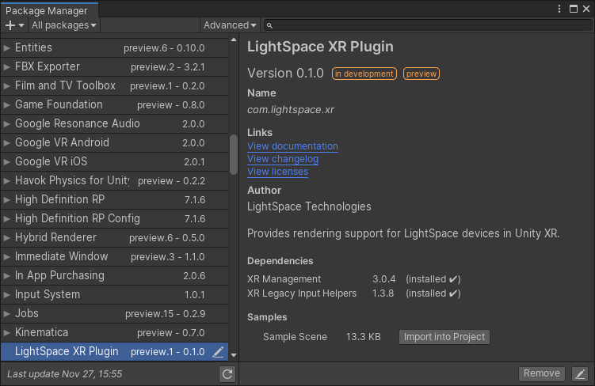
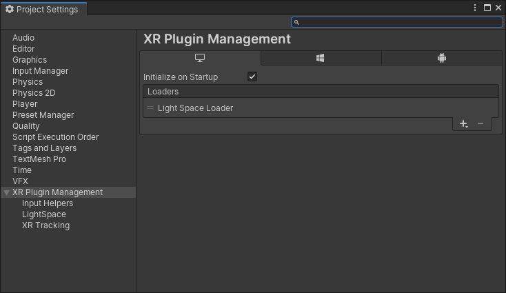
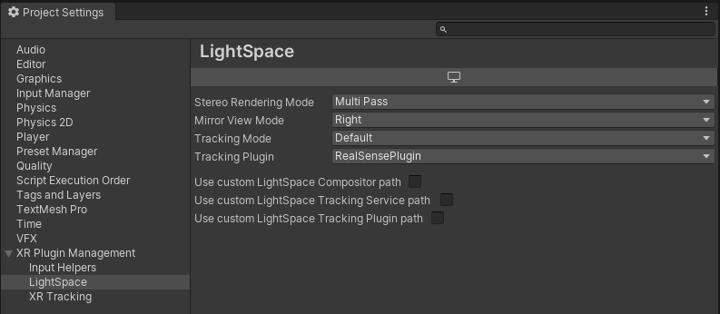

# LightSpace XR SDK Package

The purpose of this package is to provide compatibility between LightSpace AR headsets and Unity XR rendering. This package provides the necessary sdk libraries for users to build Applications that work with the LightSpace AR headsets.

* _Tested with Unity 2019.3.0f1 using XR Management 3.0.4 package_
* _Tested with Unity 2019.3.0f6 using XR Management 3.0.6 package_

## Adding LightSpace XR Plugin Unity package to project

To add **LightSpace XR Plugin** package to a new Unity project:
1) Go to _Package Manager_
2) Click "+" and select option _Add package from disk...
3) Navigate to where _com.lightspace.xr_ is on your machine and select _package.json_ 

When successfully added to project LightSpace XR Plugin package can be found under Package manager.

Sample scene can be optionally added to project for quick setup.

## Configure Unity project to use **LightSpace XR Plugin**
   
Go to _Project Settings_ and under _XR Plugin Management_ add _Light Space Loader_.

Check if LightSpace XR Settings are created if not, create new

